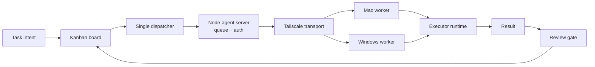

# Switchyard

Control plane untuk alur coding agent. Switchyard menyimpan board dan task, memilih workspace, mengklaim task, mengirim pekerjaan ke executor, lalu menahan hasil di kolom `review` sampai perubahan diperiksa dan di-approve.

Stack: Go, SQLite, React, Vite, dan node-agent melalui gRPC hybrid dengan HTTP fallback.

## System model



VPS menjalankan control plane dan scheduler. Node-agent menjalankan execution plane pada host yang memiliki source code. Workspace remote tidak pernah dipakai sebagai `cwd` oleh proses lokal VPS. Workspace `/Users/...` dan `C:\...` dirutekan ke host terdaftar.

## Dispatcher dan transport

`cmd/server/ssh_dispatch.go` adalah single owner untuk claim task. Polling berjalan setiap 30 detik dan task sukses masuk ke `review`.

| Pilihan task | Jalur | Executor |
|---|---|---|
| `auto` | Legacy SSH dari VPS | Hermes di VPS, akses file lewat SSH |
| `hermes` | node-agent | Hermes di host workspace |
| `codex` | node-agent | Codex di host workspace |
| `commandcode` | node-agent | Command Code di host workspace |

`auto` dipertahankan untuk kompatibilitas task lama. Task baru yang membutuhkan worker lokal sebaiknya memilih executor secara eksplisit. Node-agent memilih gRPC bila tersedia, lalu fallback ke HTTP long-poll saat koneksi gRPC gagal.

Transport dapat dipaksa lewat konfigurasi node-agent:

```text
NODE_AGENT_TRANSPORT=auto  # auto, grpc, http
NODE_AGENT_GRPC_TARGET=<VPS_TAILSCALE_IP>:8789
```

Mode `grpc` fail-closed saat gRPC tidak tersedia. Mode `http` memaksa compatibility lane. Port gRPC `8789` harus tetap private di Tailscale.

### Hard guard, claim, dan retry

- Path remote dengan transport kosong diubah menjadi `ssh` dan target default `mac-tailscale` sebelum spawn.
- Task yang sedang dikerjakan berstatus `running`.
- Hasil sukses berstatus `review`, bukan `done`.
- Kegagalan dicoba ulang sampai tiga kali, lalu menjadi `blocked`.
- Task `review` tidak dapat dipindahkan ke `done` lewat PATCH status biasa.

## Task intent dan executor

Task menyimpan intent manusia berupa title dan description. User memilih executor AI jika ingin memaksa runtime tertentu:

```json
{"executor":"commandcode"}
```

Nilai task yang valid: `auto`, `hermes`, `codex`, dan `commandcode`.

Shell bukan pilihan input pada form task. Shell hanya dipakai oleh orchestrator untuk operasi internal yang sudah menghasilkan command konkret. Payload internal dapat membawa field `command`, tetapi field tersebut bukan data task yang diisi user.

Catatan migrasi: schema transport masih mempertahankan field `command` agar dispatch
internal dan task lama tetap kompatibel. Field tersebut tidak termasuk task intent dan
akan dihapus dari form task pada migrasi UI berikutnya.

### Command Code

Node-agent mengikuti CLI resmi Command Code:

```sh
cmd -p "<prompt>" --yolo --skip-onboarding --output-format text
```

Pada Windows binary aliasnya adalah `cmdc`. Node-agent mendeteksi `cmd`, `cmdc`, atau `command-code` sesuai platform. `--yolo` mengizinkan worker mengubah file dan menjalankan shell command, jadi gunakan hanya pada node yang dipercaya.

## Review gate

Semua executor memakai review gate yang sama:

1. Agent mengubah working tree, tetapi tidak commit atau push.
2. Board mengambil diff dari host workspace.
3. User memilih `Commit` atau `Commit & Push`.
4. Board menjalankan approval melalui SSH.
5. Status berubah dari `review` menjadi `done`.

```text
GET  /api/boards/{slug}/tasks/{id}/diff
POST /api/boards/{slug}/tasks/{id}/approve
```

Body approval:

```json
{"action":"commit","message":"optional commit message"}
```

atau `{"action":"commit_push"}`.

Workspace review harus menunjuk ke repository Git yang benar.

## Node-agent contract

Kanban mengirim payload berikut ke `POST /api/dispatch`:

```json
{
  "task_id":"t1",
  "board":"saas",
  "message":"Perbaiki validasi login",
  "workspace":"/Users/<user>/Development/saas",
  "executor":"codex"
}
```

Untuk internal shell dispatch, orchestrator mengirim `executor: "shell"` dan `command`. Dispatcher menentukan host dari workspace, memakai node-agent sebagai jalur utama, dan dapat memakai SSH sebagai fallback transport.

Saat register, node mengumumkan capability:

```json
{
  "node_id":"mac",
  "workspaces":["/Users/<user>/Development"],
  "executors":["hermes","codex","commandcode","shell"],
  "versions":{"commandcode":"..."}
}
```

Server memilih node berdasarkan prefix workspace dan capability executor. Jika executor eksplisit tidak tersedia, dispatch ditolak dengan error `executor unavailable`.

Ack dispatch mengembalikan `transport` dan `delivery_id`. Metadata ini diteruskan ke Flow diagnostics Kanban agar operator dapat melihat jalur aktual (`grpc` atau `http`) yang dipakai task.

Detail worker dan kontrak gRPC ada di repository `node-agent`, termasuk `docs/specs/2026-09-07-grpc-hybrid-node-agent-transport.md`.

## Workspace

Sumber kebenaran workspace adalah `~/.hermes/workspaces.json`.

```json
{
  "workspaces": [
    {
      "id":"saas",
      "path":"/Users/<user>/Development/saas",
      "host":"mac-tailscale",
      "os":"mac",
      "note":"PHP legacy. Jangan commit dari agent."
    }
  ]
}
```

`note` dikirim sebagai `PrequestNote`. Jika tidak ada, node-agent membaca `AGENTS.md` atau bagian awal `README.md` dari workspace.

## API utama

| Method | Path | Kegunaan |
|---|---|---|
| GET/POST | `/api/boards`, `/api/boards/{slug}/tasks` | Board dan task |
| PATCH | `/api/boards/{slug}/tasks/{id}/status` | Perpindahan status |
| PATCH | `/api/boards/{slug}/tasks/{id}/assignee` | Ganti Hermes profile |
| GET | `/api/boards/{slug}/tasks/{id}/diff` | Diff remote workspace |
| POST | `/api/boards/{slug}/tasks/{id}/approve` | Commit atau push |
| GET/POST/PUT/DELETE | `/api/workspaces*` | Workspace dan health check |
| GET | `/api/flow/active` | Flow task aktif |
| POST | `/api/remote/dispatch` | Dispatch manual ke node-agent |
| GET | `/api/nodes` | Status node-agent |

## Context optimization

Execution pipeline memiliki tiga lapisan pengurangan context:

1. `codegraph` menyediakan index struktur codebase pada host workspace.
2. `rtk` mereduksi output command yang verbose sebelum masuk ke context agent.
3. `caveman` merangkum result sebelum dikirim kembali ke orchestrator.

Codegraph sudah dijalankan sebagai preflight node-agent. Integrasi RTK saat ini tersedia di shell rewrite path. Adapter caveman perlu diaktifkan pada result pipeline sebelum dianggap sebagai bagian wajib dari deployment production.

## Konfigurasi

- `~/.hermes/config.yaml`: set `kanban.dispatch_in_gateway: false` agar tidak ada dispatcher kedua.
- `~/.hermes/workspaces.json`: workspace, host, OS, dan prequest note.
- `~/.hermes/node-agent.env`: `NODE_AGENT_TOKEN`, mode file `0600`.
- `KANBAN_NODE_AGENT`: override base URL node-agent HTTP, default `http://127.0.0.1:8788`.
- `KANBAN_NODE_AGENT_TOKEN`: shared auth token untuk node-agent HTTP dan gRPC metadata.
- `KANBAN_SSH_TARGET`: override target SSH untuk review dan legacy transport.

## Build dan deploy

### Urutan rollout

Untuk rollout bertahap, VPS dapat diperbarui lebih dulu. Agent Mac atau Windows tidak
perlu langsung di-upgrade; selama itu node lama tetap berjalan dengan capability lama.

1. Build dan restart `node-agent` server di VPS; expose HTTP `:8788` dan gRPC `:8789`.
2. Build dan restart `kanban-board` di VPS.
3. Build target worker host (`GOOS=darwin GOARCH=arm64` untuk Mac Apple Silicon atau target Windows yang sesuai).
4. Install ulang binary agent di Mac atau Windows, lalu restart LaunchAgent/service.
5. Pastikan node `idle` dan capability plus `transports` baru muncul di `/api/nodes`.
6. Jalankan dispatch canary dan pastikan result punya `success=true`, `delivery_id`, serta transport `grpc` atau fallback `http`.

```sh
go vet ./...
go test ./...
go build -o bin/kanban-board ./cmd/server
cd web && pnpm build
pm2 restart kanban-board
```

Deploy VPS tidak otomatis mengganti binary agent yang sedang berjalan di Mac. Upgrade
Mac dilakukan terpisah dengan `scripts/install-mac.sh` dari repository node-agent.

Build frontend memakai RAM. Pada VPS 2 GB, hentikan proses besar lain bila build kehabisan memory.

## Struktur kode

| Path | Peran |
|---|---|
| `cmd/server/main.go` | HTTP API dan startup |
| `cmd/server/ssh_dispatch.go` | Single dispatcher, legacy SSH, dan node-agent routing |
| `internal/kanban/kanban.go` | Model task dan migrasi kolom |
| `internal/kanban/nodeagent.go` | Client HTTP node-agent |
| `internal/kanban/workspace_validate.go` | Validasi path workspace |
| `web/src/features/board/TaskDialog.tsx` | Form task dan executor |
| `web/src/features/board/TaskDetail.tsx` | Detail task dan metadata |
| `docs/specs/` | Keputusan desain dan review gate |

## Troubleshooting

### `executor unavailable on node`

Pastikan binary tersedia pada host worker dan node-agent sudah restart agar capability terdaftar ulang:

```sh
curl -H "X-Node-Agent-Token: <token>" http://<vps>:8788/api/nodes
```

Health check hybrid:

```sh
curl -H "X-Node-Agent-Token: <token>" http://<vps>:8788/health
```

Node sehat berstatus `idle`. Worker gRPC menampilkan `transports: ["grpc", "http"]`. Jika gRPC putus, mode `auto` memakai HTTP fallback dan status transport pada flow berubah menjadi `http`.

Jika server VPS sudah baru tetapi agent Mac belum di-upgrade, executor baru seperti
`commandcode` belum akan muncul pada node tersebut. Itu kondisi yang diharapkan sampai
installer Mac dijalankan.

### Task remote mencoba jalan di VPS

Periksa `workspace_path`, `workspace_transport`, dan `workspace_ssh_target`. Path Mac atau Windows harus terdaftar di `workspaces.json`.

### Task berhenti di `review`

Itu perilaku yang diharapkan. Buka diff, lalu pilih `Commit` atau `Commit & Push`.

## Dokumen terkait

- [Single dispatcher dan review gate](docs/specs/2026-09-07-single-dispatcher-review-gate-design.md)
- `node-agent` repository
- [Command Code headless mode](https://commandcode.ai/docs/headless)
- [Command Code CLI reference](https://commandcode.ai/docs/reference/cli)
- [RTK](https://github.com/rtk-ai/rtk)
- [Caveman](https://github.com/JuliusBrussee/caveman)
