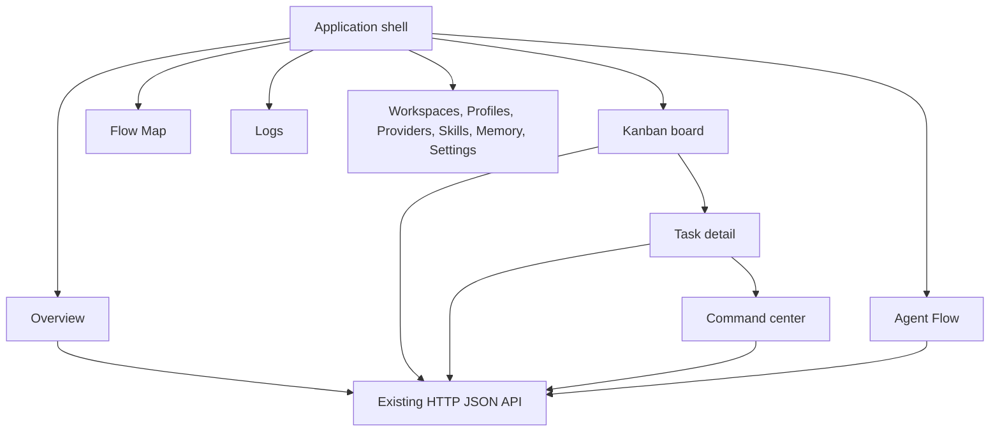
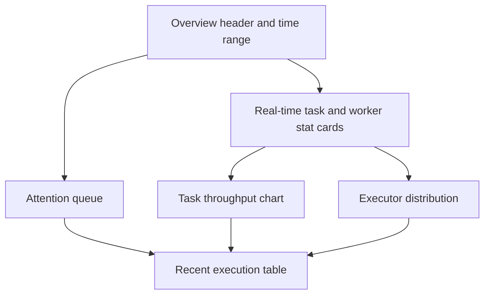
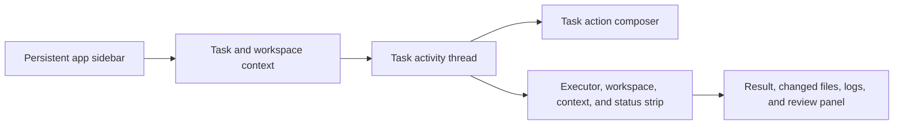

# BoardUI redesign specification

Status: proposed implementation plan.  
Branch: `redesign/boardui-ui`.  
Scope: frontend-only visual system migration for `kanban-board`.

## 1. Goal

Redesign the kanban-board frontend with BoardUI foundations, components, blocks, and
selected templates while preserving the application's current behavior, page structure,
routes, data ownership, and task execution workflow.

The result is an operations workspace for agent-managed software tasks. It is not a
marketing dashboard and it is not a clone of Cursor, Claude Code, Linear, or BoardUI's
demo application.

The redesign has four user-facing surfaces:

1. A kanban board for queue management and task state transitions.
2. An operations overview for task, worker, and executor activity.
3. A command center for one task's agent conversation, execution state, changes, and
   review handoff.
4. Existing administration and observability pages, restyled without changing their
   responsibilities.

## 2. Constraints that must remain true

The UI migration must not change the following contracts unless a separate backend
design is approved:

| Area | Constraint |
|---|---|
| Backend API | Existing HTTP JSON endpoints remain the source for board, task, workspace, profile, provider, log, flow, and settings data. |
| Routing | Keep current routes from `web/src/lib/routes.ts`. Additive routes are allowed only when registered there. |
| Task lifecycle | The statuses, dispatch behavior, executor selection, review gate, stop action, and task detail behavior stay unchanged. |
| Data fetching | Keep TanStack Query as the client cache and mutation layer. |
| Node-agent | Do not require gRPC, streaming, or node-agent deployment work for the visual migration. The UI must work with current HTTP polling data. |
| Positioning | Keep the application shell, sidebar location, board column layout, filter rail, and Flow Map topology recognizable. |
| Accessibility | Keyboard operation, focus visibility, empty, loading, and error states are required for every data surface. |
| Responsive behavior | The board may horizontally scroll on narrow screens. Dialogs, side panels, filters, and dashboard grids must reflow without clipped controls. |

`command` is not a task authoring field. A task author supplies intent through title and
body, then selects a supported executor when needed. Internal shell commands remain an
orchestrator-to-worker payload and must not be surfaced as a normal BoardUI form field.

## 3. Design direction

Reading this as: an engineering operations workspace for people supervising coding
agents, with BoardUI's semantic component system adapted to an evidence-first control
surface. Dial `ENERGY 2 / RHYTHM 2 / MOTION 1`.

| Decision | Direction | Reason |
|---|---|---|
| Theme | Dark-first operations interface, with a complete light theme only when it is implemented and tested. | Logs, execution status, code changes, and the current product use dark surfaces for extended technical work. |
| Accent | One semantic accent for selected state, focus, and successful active flow. Reserve status colors for actual task state. | Accent color must guide attention, not decorate every surface. |
| Typography | BoardUI type scale with readable proportional body text. Use monospace only for task IDs, paths, commands, timestamps, and code. | Dense operational data benefits from scanning without turning prose into terminal decoration. |
| Layout | Persistent sidebar, page header, then content-specific workspace. Preserve the existing filter rail and board columns. | Users should retain spatial memory while the visual system changes. |
| Cards | Cards group task and metric units. Avoid putting every section in identical floating cards. | Board columns, log tables, and Flow Map need different density and hierarchy. |
| Motion | Short state transitions, progress feedback, and route-level continuity only. Respect `prefers-reduced-motion`. | Motion should confirm an interaction or task transition, not compete with live execution data. |
| Identity motif | A restrained execution signal: a thin active edge or progress marker used only for live task/worker state. | The product's core event is work moving through a controlled execution path. |

Do not add decorative grids, generic AI sparkles, fake activity, fabricated metrics,
placeholder testimonials, or controls without behavior.

## 4. Target information architecture

Existing pages remain. The redesign adds an Overview page and a Command Center task
view. The latter can initially be a visual composition around current task data and
execution logs. A live conversation stream is a later backend capability.



### 4.1 Page responsibilities

| Page | Primary question | Primary content | BoardUI candidates |
|---|---|---|---|
| Overview | What needs attention now? | Real task counts, recent failures, active workers, executor distribution, recent activity. | Sidebar, Stat Cards, Data Table, selected chart blocks. |
| Kanban board | What task moves next? | Existing columns, cards, filters, create task, status and assignment controls. | Sidebar, Select, Input, Button, Badge, Dialog, Dropdown. |
| Task detail | What is this task and what action is available? | Intent, state, assigned profile, workspace, executor, result, review actions. | Tabs, Badge, Card, Dropdown, Dialog. |
| Command Center | What happened while an agent worked on this task? | Task conversation when available, execution timeline, result, context metadata, review handoff. | AI Chat template primitives, Composer, Agent Thinking, Agent Progress, code/change panel. |
| Logs | What failed or completed recently? | Filterable execution records and result excerpts. | Data Table, Table, Select, Date Picker. |
| Agent Flow | Which work is moving through the system? | Existing task flow visualization and current state. | Existing custom graph remains the renderer; BoardUI only supplies surrounding controls and tokens. |
| Flow Map | How do dispatcher, workers, executors, and review relate? | Existing topology and live routing labels. | Existing custom graph remains the renderer; BoardUI only supplies shell and legend primitives. |
| Configuration pages | Which resources can tasks use? | Workspaces, profiles, providers, skills, memory, settings. | Table, Form primitives, Settings Modal where it maps to real behavior. |

### 4.2 Sidebar navigation

Keep all current destinations. Add `Overview` above `Kanban Board`. Do not add
navigation entries for features that do not exist.

Suggested grouping:

```text
Workspace
  Overview
  Kanban Board
  Agent Flow
  Flow Map

Operations
  Logs
  Workspaces
  Agent Profiles
  Providers
  Skills
  Memory

System
  Settings
```

The sidebar remains collapsible. Its collapsed state must preserve accessible labels via
tooltips and `aria-label` values.

## 5. BoardUI adoption strategy

BoardUI provides an MCP server, an installable agent skill, a component registry, and
Pro templates. Use the component source as project-owned code after installation. Do
not assume a component is available without confirming its BoardUI tier and license.

### 5.1 Required setup sequence

Run these commands only on the redesign branch and review generated changes before
committing them:

```bash
cd /path/to/kanban-board-redesign/web
npx boardui@latest init
```

Install the BoardUI skill for the coding-agent environment used by the team. BoardUI's
Codex client installation normally targets the user's agents directory. For a
repository-owned workflow, keep the installed skill or a short project instruction in
a path the team's agents load, and document the chosen path in `AGENTS.md`.

```bash
cd /path/to/kanban-board-redesign
npx boardui@latest skill --client codex
```

For live component discovery and source installation, register the MCP server in the
developer's Codex configuration and restart the agent session:

```bash
codex mcp add boardui -- npx -y boardui@latest mcp
```

The exact Codex command can vary by installed Codex version. If it differs, register
the stdio command `npx -y boardui@latest mcp` through that version's MCP settings.

Before running `init`, inspect these files because BoardUI may update them:

```text
web/package.json
web/src/index.css
components.json
AGENTS.md
.cursor/rules/
```

Do not overwrite existing aliases, custom Tailwind setup, app tokens, or project agent
instructions. Merge them deliberately.

### 5.2 Component installation policy

Install base primitives first, then blocks, then the AI Chat template. This limits the
number of concurrent style and dependency changes.

| Stage | BoardUI items | Local destination and use |
|---|---|---|
| Foundation | theme, Button, Input, Select, Textarea, Label, Badge, Tabs, Tooltip, Switch, Table | `web/src/components/ui/` or a clearly separated BoardUI namespace. Used across existing pages. |
| Shell | Sidebar, Breadcrumb, Dropdown, Avatar, Notification Center if backed by real data | `web/src/components/`. Replace visuals in `AppSidebar.tsx`, not routing behavior. |
| Data surfaces | Stat Cards, Data Table, date/filter primitives | `web/src/features/overview/` and `web/src/features/logs/`. |
| Agent surfaces | Agent Thinking, Agent Progress, Composer, Composer Panel | `web/src/features/command-center/`. Only render controls that have a supported action. |
| Template | AI Chat | Isolate under `web/src/features/command-center/boardui/` and adapt imports. Do not copy template routes or fake demo data into the application. |

If BoardUI's generated file conflicts with a current component of the same name,
compare its public API, then either adapt the existing component in place or install
under `components/boardui/`. Do not replace components blindly across all imports.

### 5.3 Pro component rule

AI Chat, many charts, and several agent blocks are Pro content. An agent may inspect
public documentation but cannot obtain protected source without an activated license.

Do not commit a license key, generated credential, or local BoardUI authentication
file. If no license is available, use current project primitives to implement the same
required product behavior, and label the corresponding plan item as blocked rather
than inventing a lookalike presented as BoardUI source.

## 6. Component mapping

### 6.1 Current component ownership

Current UI source is organized around these files:

```text
web/src/App.tsx
web/src/components/AppSidebar.tsx
web/src/components/ui/
web/src/features/board/
web/src/features/flow/
web/src/features/logs/
web/src/features/workspaces/
web/src/features/profiles/
web/src/features/providers/
web/src/features/skills/
web/src/features/memory/
web/src/features/settings/
```

Preserve this feature ownership. BoardUI is a design system dependency, not the new
application architecture.

### 6.2 Migration map

| Current file or surface | Change | Preserve |
|---|---|---|
| `web/src/index.css` | Replace hard-coded visual tokens with BoardUI semantic tokens, then map project status colors to semantic variables. | Reduced-motion handling and necessary graph animation styles. |
| `web/src/components/ui/*` | Audit each primitive against the BoardUI counterpart. Migrate one primitive at a time. | Existing public prop contracts when multiple features consume them. |
| `web/src/components/AppSidebar.tsx` | Use BoardUI sidebar styling and composition. | `Page` values, `onSelectPage`, collapsed preference, visible item logic. |
| `web/src/App.tsx` | Extract page shell and route-specific headers only when that reduces duplication. | Queries, mutations, status transitions, filter behavior, board column positions. |
| `features/board/TaskCard.tsx` | Apply BoardUI card, badge, menu, and action styling. | Open, move, stop, reassign, and workspace/profile behavior. |
| `features/board/TaskDialog.tsx` | Use form primitives and clear executor selection. | Title/body task intent, validation, and API payload shape. |
| `features/board/TaskDetail*.tsx` | Introduce a structured detail header and tabs. | Result display, status, review actions, route and close behavior. |
| `features/flow/*` | Restyle controls, legends, and surrounding panels. | Graph layout, nodes, edges, state-derived paths, and live behavior. |
| `features/logs/LogsPage.tsx` | Move log rows to BoardUI Data Table only if sorting/filtering behavior can be retained. | Existing log data and failure visibility. |

## 7. Overview dashboard

Create `web/src/features/overview/OverviewPage.tsx`. Add a page value, route, sidebar
entry, page title, and query integration without changing the current board default
until product owners explicitly choose a new landing route.

### 7.1 Data rule

Every displayed metric must come from an endpoint or a transparent client-side
calculation over existing task data. Do not display invented uptime, token savings,
cost totals, agent confidence, or trend percentages.

The initial dashboard can use current task data. Add a dedicated backend endpoint only
when the client cannot calculate the metric accurately or efficiently.

### 7.2 Initial layout



Initial card candidates, only when source data exists:

| Card | Calculation | Empty behavior |
|---|---|---|
| Running tasks | Count tasks where `status === running`. | Show `0` with a plain explanation. |
| Review queue | Count tasks where `status === review`. | Show `0` with a plain explanation. |
| Failed tasks | Count tasks where `status === failed` in selected scope. | Show `0`; do not imply reliability percentage. |
| Active workers | Count online nodes if node status data exists. | Show `Unavailable` when node data is absent. |

Charts must earn their place. Start with at most these two:

1. Task throughput over a chosen real time window, when timestamps are available.
2. Executor distribution based on `resolved_executor` or `executor`, when data is
   available.

Do not render a chart with fewer than two meaningful data points. Use an informative
empty state instead.

## 8. Command Center and AI Chat template

The AI Chat template is a composition reference and optional source package for a new
task-scoped workspace. It must not replace the kanban board or introduce an independent
chat task model.

### 8.1 Command Center route and entry points

Add a task-scoped route such as:

```text
/boards/:slug/tasks/:taskId/command-center
```

Register it in `web/src/lib/routes.ts`. Add a real `Open Command Center` action from
the task detail view only after the route exists.

### 8.2 Composition



Map template areas to product data as follows:

| AI Chat visual area | Product-backed content | Initial behavior |
|---|---|---|
| Agent sidebar | Current board, workspace, profile, and related tasks. | Navigation uses real routes. |
| Conversation thread | Task body, dispatch event, progress events if available, result, review events. | Render chronological system/task events. |
| Composer | Task follow-up or retry request. | Hide until an API contract exists. Do not ship a fake send button. |
| Model picker | Selected executor and profile capabilities. | Read-only display initially, or use an existing assignment flow. |
| Context meter | Actual context/token data only. | Hide when data is not collected. |
| Changes panel | Changed files and diff preview when available from execution metadata. | Show result excerpt or an explicit unavailable state initially. |
| Browser preview | Preview URL returned by an executor, if supported. | Omit until a trusted preview URL contract exists. |
| Review panel | Existing review status and actions. | Keep current review gate behavior. |

The template's demo repository tree, fictitious chat rows, feedback actions, microphone,
and preview must not ship unless backed by a product feature.

### 8.3 Data contract for later live interaction

The visual redesign does not add these APIs, but agents implementing live Command
Center interaction should propose them before adding the composer:

```ts
type TaskEvent = {
  id: string
  task_id: string
  type: "task_created" | "dispatched" | "progress" | "result" | "review" | "error"
  message: string
  created_at: string
  metadata?: Record<string, string>
}

type TaskExecutionView = {
  task_id: string
  executor?: "hermes" | "codex" | "commandcode" | "auto"
  resolved_executor?: string
  events: TaskEvent[]
  changed_files?: string[]
  preview_url?: string
  context_tokens?: { used: number; limit: number }
}
```

Do not expose internal `command` values to this response. Return only task-level
information that the user is authorized to see.

## 9. Implementation phases

Each phase must build successfully before the next begins. Keep commits small and
independently reviewable.

### Phase 0: Baseline and design-system audit

1. Create this branch or use the existing `redesign/boardui-ui` worktree.
2. Record `git status --short` and do not absorb unrelated changes from `main`.
3. Run `pnpm build` in `web/` before UI changes.
4. List existing UI primitives and their importers with `rg`.
5. Install or configure BoardUI only after reviewing its generated changes.

Exit criteria: baseline build passes and the dependency/style merge plan is written in
the implementation PR description.

### Phase 1: Foundation

1. Introduce BoardUI theme tokens in `web/src/index.css`.
2. Map application states to semantic variables: success, warning, danger, info,
   selected, muted, surface, border, focus ring.
3. Migrate base primitives that have broad use: button, input, select, textarea, badge,
   tooltip, tabs, dialog, dropdown, table.
4. Verify each primitive in default, hover, active, disabled, focus-visible, error, and
   dark/light states when both themes ship.

Exit criteria: no visual regression in task creation, filters, status actions, dialogs,
or keyboard focus.

### Phase 2: Application shell and board

1. Migrate `AppSidebar.tsx` to the chosen BoardUI sidebar composition.
2. Preserve sidebar preferences and every existing destination.
3. Restyle the header, filter rail, board columns, and task cards.
4. Keep board column order and horizontal overflow behavior unchanged.
5. Update task dialogs and detail views without changing request payloads.

Exit criteria: a user can create, filter, open, update, stop, and review a task using
the same application behavior as before the redesign.

### Phase 3: Overview and data blocks

1. Add `features/overview/OverviewPage.tsx` and route integration.
2. Use real data only and add loading, error, and empty variants.
3. Add chart blocks one at a time, first proving the metric source.
4. Keep charts responsive and keyboard-accessible where their library supports it.

Exit criteria: dashboard renders with populated data and with no tasks, and every
number can be traced to an API response or documented client calculation.

### Phase 4: Command Center

1. Install or adapt the AI Chat template under an isolated feature directory.
2. Remove demo data and unused controls immediately.
3. Bind the layout to existing task and result data.
4. Add a route and task-detail entry point.
5. Add live progress, composer, diff, and preview only when corresponding backend
   contracts exist.

Exit criteria: Command Center is a usable task observation page, not a static chat
mockup.

### Phase 5: Flow, logs, and configuration pages

1. Apply the primitives and tokens to Flow pages without replacing graph rendering.
2. Migrate logs and configuration tables/forms.
3. Check all page-level empty, loading, and error states.

Exit criteria: all sidebar destinations use the same visual system and retain their
current functions.

### Phase 6: Quality pass

1. Run `pnpm build`.
2. Exercise primary keyboard paths: sidebar, create task, filters, selects, dialogs,
   task actions, and route transitions.
3. Check narrow and wide viewport behavior.
4. Check reduced-motion behavior.
5. Check console errors and network failures.
6. Review light theme only if it is exposed to users.

## 10. File-level implementation checklist

| File | Expected work |
|---|---|
| `web/package.json` | Add only dependencies required by chosen BoardUI components. Avoid duplicate chart or primitive libraries. |
| `web/src/index.css` | Merge semantic token layers, theme variables, focus treatment, and reduced-motion rules. |
| `web/src/components/ui/*` | Replace or adapt primitives in controlled batches. |
| `web/src/components/AppSidebar.tsx` | Adopt visual shell while preserving page selection and preferences. |
| `web/src/App.tsx` | Add Overview and Command Center route rendering; keep board state and mutations intact. |
| `web/src/lib/routes.ts` | Add route parsing and construction for additive routes. |
| `web/src/lib/sidebar-preferences.ts` | Add `overview` only if navigation exposes it. |
| `web/src/features/overview/OverviewPage.tsx` | New page, with real-data adapters and complete states. |
| `web/src/features/command-center/*` | New isolated feature for AI Chat composition and task event adapters. |
| `web/src/features/board/*` | Visual migration only unless an existing behavior is broken and needs a targeted repair. |
| `web/src/features/flow/*` | Token and control restyle only. Do not destabilize layout algorithms. |
| `web/src/api.ts` | Add types/endpoints only for approved backend data. Do not create speculative calls. |

## 11. Testing matrix

| Surface | Required checks |
|---|---|
| Sidebar | Expanded/collapsed, active state, keyboard navigation, tooltips, route change. |
| Board | All statuses, no tasks, many tasks, horizontal overflow, filters, task actions. |
| Task form | Validation, executor options, disabled submit, API error, Escape close. |
| Detail and Command Center | Missing result, long result, failed task, review task, unknown executor, unavailable logs. |
| Overview | Data present, no data, loading, error, narrow layout, metric provenance. |
| Charts | Zero/one/many data points, long labels, tooltip keyboard behavior where supported. |
| Flow pages | Idle, running, failed, and review paths; reduced motion. |
| Themes | All exposed themes, contrast and focus state. |

Run:

```bash
cd /path/to/kanban-board-redesign/web
pnpm build
```

If browser automation is available, add focused tests for routing, task creation, filter
behavior, and Command Center navigation. Do not claim visual completion from a build
alone.

## 12. Completion criteria

The redesign is ready for review only when all points below are true:

- BoardUI components are installed from the registry or adapted with an explicit source
  and license decision.
- The app retains every existing functional route and primary task action.
- The board, Flow Map, and agent execution views retain their information hierarchy.
- Overview metrics and charts use real data or show an explicit unavailable state.
- Command Center contains no demo conversations, fictional repositories, fake code
  changes, inactive microphone, or inactive send action.
- Every data surface has loading, empty, and error states.
- Keyboard focus is visible and dialogs close with Escape.
- Reduced motion is respected.
- `pnpm build` passes.
- The implementation documents each major visual decision and its purpose in the PR.

## 13. Explicit non-goals

- Rewriting the backend, node-agent protocol, dispatcher, or gRPC plan.
- Replacing the custom Flow Map renderer with a dashboard chart.
- Adding a general-purpose chat system without an approved event and message API.
- Showing internal shell dispatch commands in task creation or task detail UI.
- Changing executor availability rules or bypassing capability checks.
- Adding fabricated metrics to make the dashboard look populated.

## 14. Handoff notes for the next agent

1. Work only in `redesign/boardui-ui` or a child branch of it.
2. Start from Phase 0 and inspect actual project files before applying a BoardUI command.
3. Use the BoardUI skill for component selection and theming guidance. Use the MCP for
   source and usage examples. Confirm Pro access before requesting protected sources.
4. Make one visual-system change per commit group: foundation, shell, board, overview,
   Command Center, then remaining pages.
5. Do not bundle backend contract changes with visual changes. Write a separate API
   proposal first if Command Center needs new live data.
6. Before handoff, provide the changed files, build result, manual checks performed,
   known visual differences, and any BoardUI license dependency.
